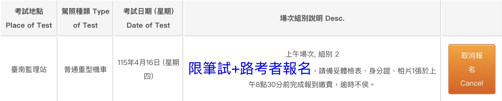
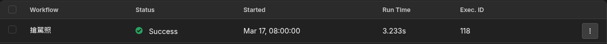

# 🚀 TurboHippo | 駕照預約自動化工作流

## 📋 專案動機 // DEV_STORY

這是一個關於開發者手速感人的悲傷故事。

到了 18 歲，考取機車駕照是不少台灣人的必經之路，我也不例外。但現實是殘酷的——**機車駕照考試名額超級難搶，幾乎在釋出名額的一分鐘內就會被秒殺額滿。**

在經歷過多次手動填資料、最後還是看著**名額已滿**的失敗後，一氣之下我決定不拚手速了，我要借助科技的力量。

我使用了 [n8n](https://n8n.io/) 自動化工具，搭配自己寫的一些 JavaScript 邏輯，做成了一個能**自動搶名額的工作流**。結果非常成功！我順利搶到了名額。

當我把這個成果發到 IG 限時動態後，引發了熱烈的迴響，發現大家都深受搶不到名額所苦。原本我只打算把簡單的 Source Code 丟給他們自己操作，但後來考量到：**要求沒有接觸過這類工具的使用者，自己架設地端 n8n 並修改資料部署，門檻有點高了。**

為了解決這個痛點，我又花了一整天優化互動介面，將這個工作流升級，用 **Telegram Bot** 的方式，做出一個能與使用者互動的簡單報名介面。
最後，希望能造福同樣深受秒殺之苦的你！

---

## 🎉 成果展示

 
*成功報名畫面*

 
*工作流後台執行紀錄*

## 🤖 使用開發者架設的 Telegram Bot 服務

**👉 [點擊這裡加入 Telegram Bot](https://t.me/Turbo_Hippo_bot)**

### 關於本服務

* **流量限制 (需索取過濾碼)**：因為這是我的個人自架服務，伺服器資源有限，我並不希望湧入太多流量導致機器崩潰。因此，機器人設有過濾機制。
* **如何取得使用權限？**：如果您想使用這項服務，請私訊我的 Instagram [@jyc_320](https://instagram.com/jyc_320) 或來信 [jyc_320@proton.me](mailto:jyc_320@proton.me) 向我索取「過濾碼」。在填入資料時輸入正確的過濾碼，才能成功登記。

## 💻 自行部署指南

若您基於最高級別的隱私考量，或是希望完全掌握系統架構與資料流向，本專案提供完整的工作流腳本 (Workflow JSON)，支援於本地端或雲端伺服器自行部署。

> **💡 部署先備知識**
> 選擇自行架設，您需要具備以下技術基礎：
> 1.  **環境建置**：熟悉 n8n 伺服器的部署與運行 (例如使用 Docker、n8n Cloud 等)。
> 2.  **憑證配置 (Credentials)**：了解如何在 n8n 中設定第三方 API 授權 (包含 Google Service Account 認證與 Google Sheets API 啟用)。
> 3.  **Bot 串接**：熟悉 Telegram 機器人基礎，能透過 `@BotFather` 取得 Bot Token 並與系統綁定。

### 📦 部署選項

本專案提供兩種不同複雜度的工作流，請依個人需求選擇：

#### 方案 A：單人極簡版

本版本為核心排程腳本，移除了所有前端互動與資料庫依賴，專注於底層的自動化 API 請求。適合單一使用者快速建置與執行。
* **配置指南**：
    1. 將 JSON 檔案匯入您的 n8n 工作區。
    2. 開啟流程最前端的 **「設定個人資料 (Set Node)」** 節點。
    3. 將您的報名所需參數寫入對應的欄位中，作為全域變數。
    4. 儲存並啟用 (Activate/Publish) 工作流，系統即會依排程自動執行。
* **[單人極簡 JSON](JSON設定檔/搶駕照(original_public).json)** 

#### 方案 B：完整互動版

即本文件展示的完整生產環境架構。整合了 Telegram 互動介面、防呆過濾、Google Sheets 資料庫讀寫，以及完善的例外處理與自動刪除機制。
* **配置指南**：
    1. 將 JSON 檔案匯入 n8n。
    2. 於對應節點綁定您專屬的 **Telegram Bot API** 與 **Google Service Account** 憑證。
    3. 建立對應格式的 Google Sheets 試算表，並將 `Document ID` 填入所有涉及表單操作的 Google Sheets 節點中。
    4. 於 **「過濾密語 (If Node)」** 節點中自訂您的專屬通關密碼，以阻擋未授權的外部存取，或是取消此機制。
    5. 儲存並啟用工作流，於 Telegram 測試 `/start` 指令。
* **[完整互動 JSON](JSON設定檔/搶駕照(interactive_public).json)** 

## ⚙️ 系統運行機制

本系統基於排程自動化運作，具體執行流程如下：
* **⏰ 自動化觸發**：系統排程於每日早上 `07:59:59` 啟動以預留資料讀取時間，準備迎接 `08:00:00` 的監理站名額釋出。
* **📬 狀態主動推播**：無論當日是否有符合條件的場次、或是報名成功與否，系統皆會透過 Telegram 回報結果。
* **🧹 使用後即焚機制**：基於資安考量，報名成功或確認無場次後，系統將自動觸發刪除程序，將您的個人資料從 Google Sheets 資料庫中徹底抹除。
* **⚠️ 強烈建議自行人工複查**：自動化程式可能因網頁結構改變或網路延遲而發生誤判。**收到報名成功通知後，請務必自行登入「[監理服務網](https://www.mvdis.gov.tw/)」查詢，確認最終報名狀態。**

## ⚖️ 法律免責與隱私聲明

> [!WARNING]
> **使用本服務或下載本開源專案前，請務必詳細閱讀以下聲明。開始使用即代表您同意以下條款：**

1.  **非官方授權**
    本專案為第三方開發之自動化輔助程式，與中華民國交通部公路局及各區監理所**無任何官方合作或授權關係**。
2.  **不保證報名結果**
    報名成功率受限於多重不可控因素（包含但不限於：監理站伺服器當機、網路延遲、防爬蟲機制阻擋、當日無名額釋出等）。本系統僅為「輔助送出表單」之工具，**絕不承諾或保證 100% 報名成功**。
3.  **隱私與資安風險自負**
    * **開發者已盡力維護資訊安全**：本系統採用 Google 官方基礎設施，並以開發者能力設計了「閱後即焚」機制，最大程度保護個資。
    * **對於使用機器人服務者**：您的個人資料（身分證字號、生日、聯絡方式等）僅用於該次自動填表流程。雖系統設有自動刪除機制，但網路傳輸仍有潛在風險。如因不可抗力之因素（如駭客攻擊）導致資料外洩，本系統開發者不負相關賠償責任。
    * **對於自行架設者**：請妥善保管您的 Google API 憑證與 Telegram Token，若因個人設定不當導致個資外洩，需自行承擔後果。
4.  **資源合理使用聲明**
    本專案為開源技術交流性質，旨在解決個人考照報名不便之痛點。**嚴禁將本程式用於商業「代搶名額」牟利，或利用高頻率請求惡意攻擊（DDoS）政府網站。** 若因濫用導致 IP 遭到官方封鎖或觸犯相關法律，使用者須自負全責。
5.  **最終解釋權**
    所有報名狀態、場次資訊與考照規定，**一律以「監理服務網」官方系統顯示與公告為準**。本程式若因監理網 API 異動或網頁改版而失效，開發者無義務提供即時修復。